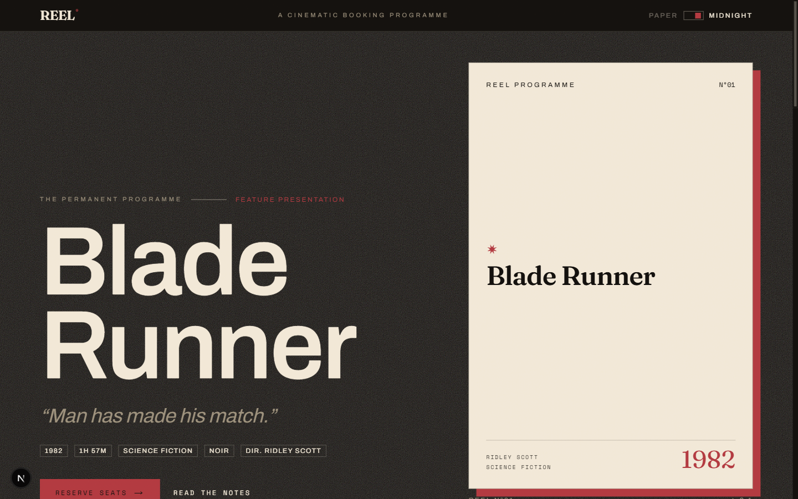
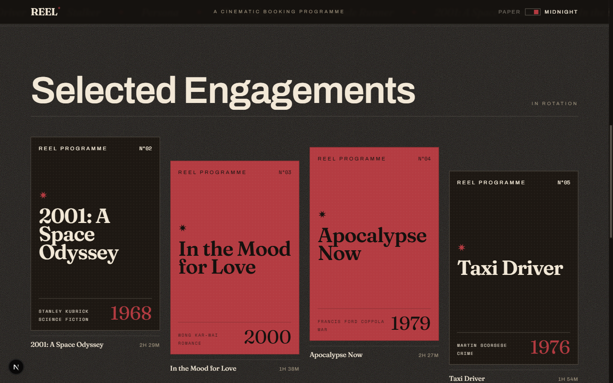
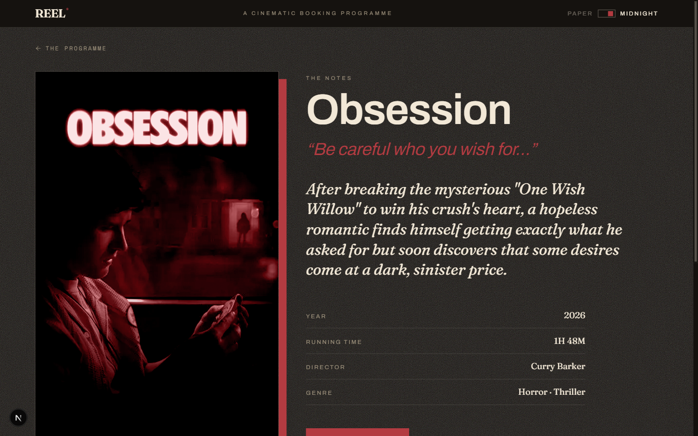
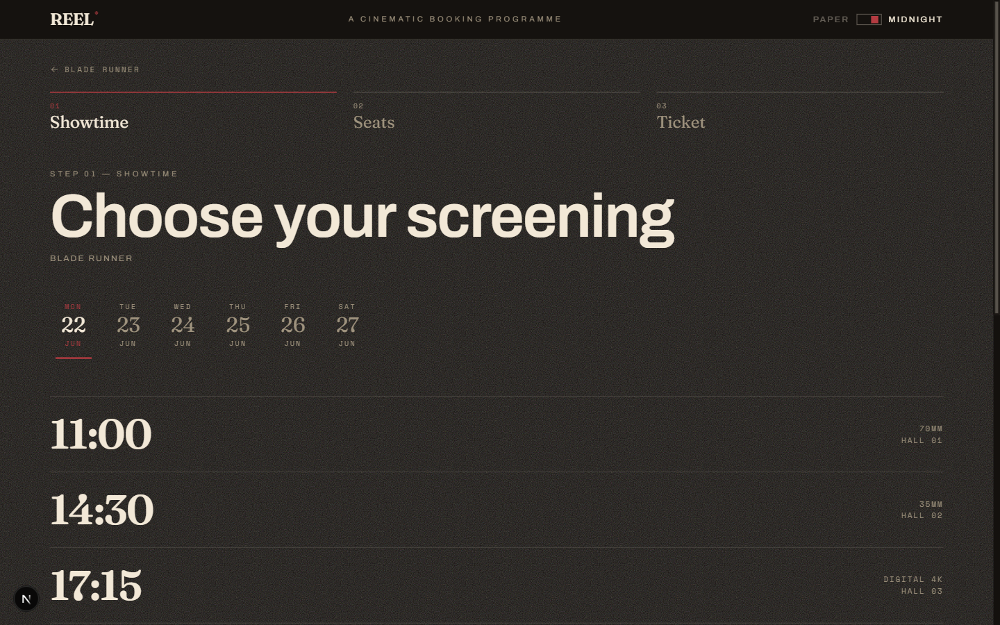
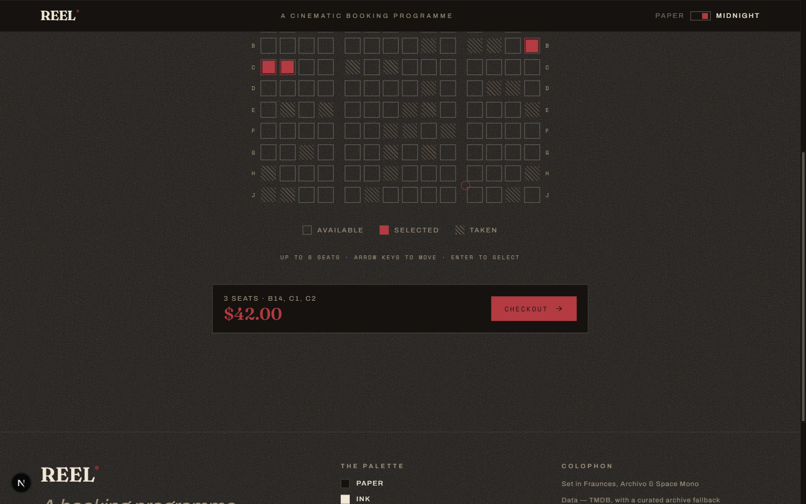
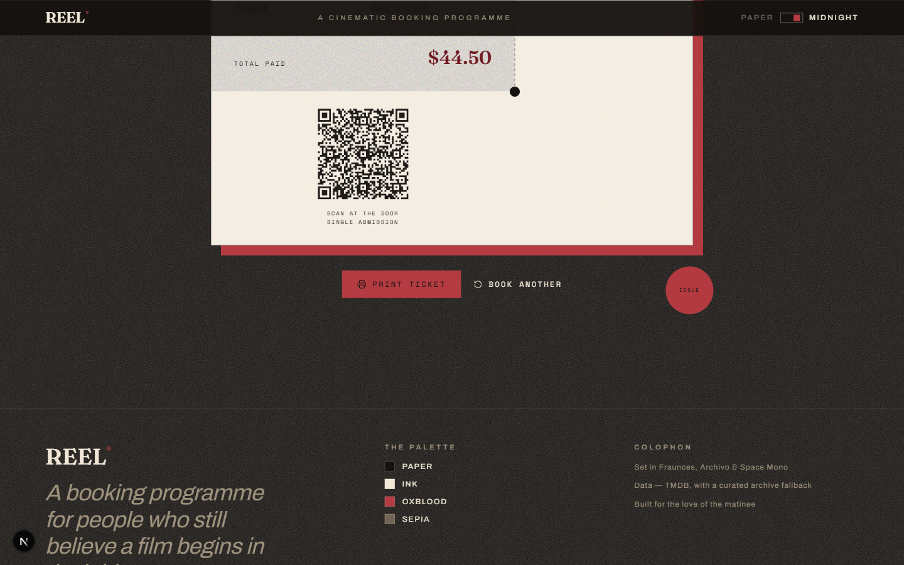
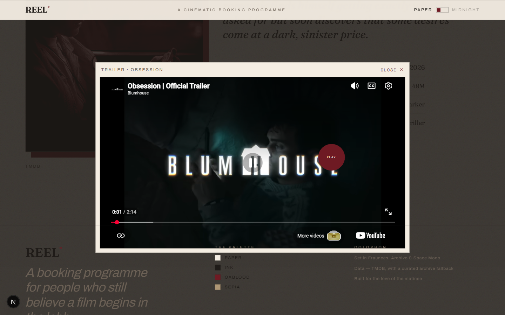
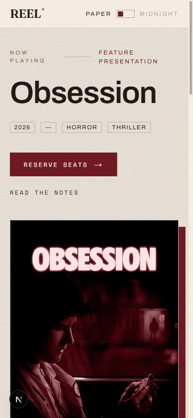

# REEL — A Cinematic Booking Programme

> _A 1970s film-festival programme, rebuilt for the web._

### ▶ [**Live demo — cinebook-advanced.vercel.app**](https://cinebook-advanced.vercel.app)

Deployed on **Vercel**. The live build runs the curated offline programme; add a
`TMDB_API_KEY` to light up real _Now Playing_ data (see
[Data](#data--tmdb-with-a-graceful-fallback)).

REEL is a portfolio-grade movie booking experience designed like a Criterion
booklet crossed with a high-fashion editorial spread. Pick a film, read the
notes, choose a showtime, claim your seats on a print-blueprint floor plan, and
walk away with a perforated, scannable **e-ticket**. Modern execution, retro
soul — every screen is meant to look intentional, editorial, and expensive.

Built with **Next.js 16** (App Router) · **React 19** · **TypeScript 6** ·
**Tailwind CSS v4** · **Motion** · **Zustand**.

---

## Contents

- [Gallery](#gallery)
- [The experience](#the-experience)
- [Design system](#design-system)
- [Data — TMDB with a graceful fallback](#data--tmdb-with-a-graceful-fallback)
- [Getting started](#getting-started)
- [Project structure](#project-structure)
- [Accessibility & motion](#accessibility--motion)
- [Design decisions](#design-decisions)

---

## Gallery

| Landing — _Now Playing_ | The Programme — _typographic posters_ |
| --- | --- |
|  |  |

| Detail — _split-screen, duotone (Midnight)_ | Showtime — _kinetic time list_ |
| --- | --- |
|  |  |

| Seats — _print blueprint + price ticker_ | E-ticket — _perforated QR stub_ |
| --- | --- |
|  |  |

| Trailer — _paper-framed lightbox_ | Mobile |
| --- | --- |
|  |  |

---

## The experience

1. **Now Playing** — an editorial hero featuring one film, a kinetic title
   marquee, a staggered **bento** of posters, and a magazine-style **index** with
   a poster that trails your cursor.
2. **Movie detail** — the signature **split-screen**: a grainy burgundy-duotone
   poster on the left, the "notes" on the right (title, metadata block, synopsis
   set as a magazine pull-quote), plus a paper-framed **trailer** lightbox.
3. **Showtime + date** — a horizontal editorial date strip and times rendered as
   a kinetic typographic list with hairline separators and animated underlines.
4. **Seat selection** — an architectural **floor-plan** seat map: a curved screen,
   hairline seats, sepia hatch for taken, burgundy spring-fill for selected.
   Fully keyboard navigable, with a live count and an animated **price ticker**.
5. **Checkout & e-ticket** — a confirmation summary, then a real **scannable QR
   code** (it encodes the booking JSON) rendered as a perforated, **printable**
   ticket stub.
6. **Dark / Light** — _Paper_ and _Midnight Screening_. Both stay in the
   cream/burgundy/charcoal world; the choice persists and the swap animates as a
   film-exposure flash.
7. **Start over** — "Book Another" resets the booking and returns to the lobby.

Empty, loading and 404 states are all designed (editorial hairline skeletons,
not grey blobs).

---

## Design system

### Palette — tokens only, two themes, one world

| Token | Paper (light) | Midnight (dark) | Role |
| --- | --- | --- | --- |
| `--paper` | `#F4EDE2` | `#14110E` | Background |
| `--ink` | `#1F1B18` | `#F2E8D6` | Text |
| `--burgundy` | `#6E1A23` | `#B23A40` | The single accent |
| `--sepia` | `#AD9573` | `#6F6353` | Depth / taken seats |

No neon, no glassmorphism, no glowing tech cards — by design.

### Typography

- **Fraunces** — high-contrast serif display for titles & headlines.
- **Archivo** — grotesque for UI labels and body.
- **Space Mono** — showtimes, metadata and the ticket (deliberately _not_ the
  ubiquitous Space Grotesk).

Huge type-scale contrast; titles are dramatic.

### Motion principles

- Film-cut route transitions (a charcoal "splice" rises to reveal each screen).
- Micro-interactions: magnetic posters, kinetic type, animated hairline
  underlines, custom cursor near posters, seat-pick spring feedback, a price
  number ticker.
- **Transform / opacity only**, and everything respects
  `prefers-reduced-motion` with a calm fallback.

Reusable primitives: `Rule`, `Tag`, `Ticker`, `GrainOverlay`, `TypographicPoster`,
`Poster` (duotone), `Magnetic`, `Reveal`.

---

## Data — TMDB with a graceful fallback

REEL reads movies from the **TMDB API** but **never depends on it**:

- **With a key** → live _Now Playing_, real runtimes, directors, genres, and
  burgundy-**duotone** poster/backdrop imagery, plus real trailers.
- **Without a key (or on any network error)** → a hand-curated archive of eight
  films rendered as art-directed **typographic posters**. The app always runs,
  with zero broken images.

Add a key by creating **`.env.local`** (see [`.env.example`](.env.example)):

```bash
TMDB_API_KEY=your_tmdb_v3_api_key
```

Get a free key at <https://www.themoviedb.org/settings/api>. No key? No problem —
just run it.

---

## Getting started

Requirements: **Node 18.18+** (developed on Node 24) and npm.

```bash
npm install
npm run dev        # http://localhost:3000
```

Other scripts:

```bash
npm run build      # production build (Turbopack)
npm run start      # serve the production build
npm run lint       # ESLint
npm run format     # Prettier
```

### Deployment

REEL is deployed to **Vercel** at
[cinebook-advanced.vercel.app](https://cinebook-advanced.vercel.app). The project
is linked via the Vercel CLI, so a new production release ships with:

```bash
vercel deploy --prod
```

Connect the GitHub repository in the Vercel dashboard to enable automatic
deploys on every push. `TMDB_API_KEY` is an optional environment variable that
can be set there to enable live _Now Playing_ data.

---

## Project structure

```
src/
├── app/
│   ├── layout.tsx            # fonts, theme boot, chrome, providers
│   ├── template.tsx          # film-cut route transition
│   ├── page.tsx              # Now Playing
│   ├── loading.tsx           # editorial skeleton
│   ├── not-found.tsx
│   ├── globals.css           # Tailwind v4 @theme tokens, grain, print
│   └── film/[id]/
│       ├── page.tsx          # detail
│       └── book/page.tsx     # booking flow
├── components/
│   ├── chrome/               # header, footer, cursor, grain, smooth-scroll, theme
│   ├── primitives/           # Rule, Tag, Ticker, Poster, Magnetic, Reveal …
│   ├── home/                 # hero, marquee, bento, index
│   ├── detail/               # split-screen + trailer modal
│   └── booking/              # showtime → seats → checkout → e-ticket
├── lib/                      # tmdb, types, store, showtimes, seats, format …
└── data/films.ts            # the curated archive programme
```

---

## Accessibility & motion

- Semantic landmarks (`header` / `main` / `footer`), real heading hierarchy.
- Keyboard navigation for showtimes **and** the seat map (arrow keys + Enter);
  visible focus rings; ARIA labels and `aria-pressed` state on seats.
- Trailer modal: `role="dialog"`, Escape to close, scroll lock, focus on open.
- `prefers-reduced-motion` disables the curtain, marquee, parallax, grain
  flicker and the custom cursor.
- Both themes maintain AA-minded contrast.

---

## Design decisions

- **Posters as typography.** The bundled demo treats each poster as a 1970s
  programme card — true to the concept _and_ free of remote-image fragility.
  Real duotone imagery layers in automatically when TMDB is connected.
- **Three typefaces, on purpose.** Serif display + grotesque + mono is the
  classic editorial triad; weights are kept disciplined.
- **The ticket is paper.** The e-ticket renders in fixed cream/charcoal
  regardless of theme so the QR keeps contrast and prints correctly.
- **Deterministic showtimes & seats.** Seeded from the film/date/time so the
  same screening always yields the same hall — no hydration drift.

---

_REEL — Est. MCMLXXIV · A Portfolio Edition · MMXXVI_
